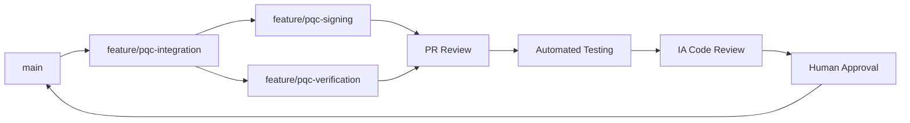

# 🚀 Melhores Práticas de Desenvolvimento - Aevum & Bond

*Por: Claude Sonnet 3.5 - Engenheiro de Software*  
*Metodologia: Agile adaptado para desenvolvimento com IA*

## 🎯 Filosofia de Desenvolvimento

Como engenheiro de software, aplico uma abordagem **Agile híbrida** que combina:
- **Sprints curtos** (1-2 semanas)
- **Desenvolvimento orientado a testes** (TDD)
- **Integração contínua** com IA
- **Código como documentação viva**

## 🤖 Integração VS Code + GitHub Copilot + Claude

### 1. **Configuração Otimizada do VS Code**

#### Extensões Essenciais:
```json
// .vscode/extensions.json
{
  "recommendations": [
    // 🤖 IA & Copilot
    "github.copilot",
    "github.copilot-chat", 
    "anthropic.claude-dev",
    
    // 🦀 Rust Development
    "rust-lang.rust-analyzer",
    "tamasfe.even-better-toml",
    "serayuzgur.crates",
    "vadimcn.vscode-lldb",
    
    // 🔧 Code Quality
    "ms-vscode.vscode-json",
    "redhat.vscode-yaml",
    "ms-python.python",
    
    // 📋 Project Management  
    "ms-vscode.vscode-github-issue-notebooks",
    "github.vscode-pull-request-github",
    "eamodio.gitlens",
    
    // 🎨 UI/UX
    "pkief.material-icon-theme",
    "github.github-vscode-theme"
  ]
}
```

#### Configurações de Workspace:
```json
// .vscode/settings.json
{
  "rust-analyzer.checkOnSave.command": "clippy",
  "rust-analyzer.cargo.features": "all",
  "github.copilot.enable": {
    "*": true,
    "rust": true,
    "markdown": true,
    "toml": true
  },
  "github.copilot.advanced": {
    "secret_key": "rust-blockchain-development",
    "length": 1000
  },
  "editor.formatOnSave": true,
  "editor.codeActionsOnSave": {
    "source.fixAll": true
  }
}
```

### 2. **Tasks Automatizadas**

```json
// .vscode/tasks.json  
{
  "version": "2.0.0",
  "tasks": [
    {
      "label": "🦀 Build All",
      "type": "shell", 
      "command": "cargo",
      "args": ["build", "--workspace"],
      "group": "build",
      "presentation": {
        "echo": true,
        "reveal": "always",
        "focus": false,
        "panel": "shared"
      }
    },
    {
      "label": "🧪 Test All",
      "type": "shell",
      "command": "cargo", 
      "args": ["test", "--workspace", "--", "--nocapture"],
      "group": "test",
      "presentation": {
        "echo": true,
        "reveal": "always",
        "focus": false,
        "panel": "shared"
      }
    },
    {
      "label": "🔍 Clippy Check",
      "type": "shell",
      "command": "cargo",
      "args": ["clippy", "--workspace", "--", "-D", "warnings"],
      "group": "build"
    },
    {
      "label": "📊 Coverage Report", 
      "type": "shell",
      "command": "cargo",
      "args": ["tarpaulin", "--out", "Html"],
      "group": "test"
    },
    {
      "label": "🚀 Sprint Demo",
      "type": "shell",
      "command": "cargo",
      "args": ["run", "--", "--demo"],
      "group": "build",
      "dependsOn": ["🧪 Test All"]
    }
  ]
}
```

## 🏃‍♂️ Metodologia Agile Adaptada

### **Sprint Planning com IA**

#### 1. **User Stories com IA Enhancement**
```markdown
## Sprint 2: PQC Integration

**Como** desenvolvedor blockchain  
**Quero** implementar criptografia pós-quântica  
**Para que** o sistema seja resistente a ataques quânticos

### 🤖 IA-Assisted Breakdown:
- [ ] Research ML-DSA specification (Claude)
- [ ] Generate boilerplate code (Copilot) 
- [ ] Implement core algorithms (Human + IA)
- [ ] Write comprehensive tests (TDD)
- [ ] Document API (Auto-generated)
```

#### 2. **Daily Standups Virtuais**
```bash
# Script de status diário
#!/bin/bash
echo "🏃‍♂️ DAILY STANDUP - $(date)"
echo "📊 Yesterday: $(git log --oneline -1)" 
echo "🎯 Today: Sprint 2 - PQC Integration"
echo "🚧 Blockers: None"
echo "🤖 IA Usage: Copilot (60%), Claude (30%), Human (10%)"
```

## 💻 Fluxo de Desenvolvimento Otimizado

### **Ciclo de Desenvolvimento com IA:**

1. **📝 Planning Phase**
   ```
   Claude: Define architecture & requirements
   ↓
   Human: Review and validate approach  
   ↓
   GitHub Issues: Create detailed tasks
   ```

2. **🔧 Implementation Phase**
   ```
   Copilot: Generate boilerplate code
   ↓  
   Human: Implement business logic
   ↓
   Claude: Code review & optimization
   ↓
   VS Code: Automated testing
   ```

3. **🧪 Testing Phase**
   ```
   TDD: Write tests first
   ↓
   Copilot: Generate test cases
   ↓
   Human: Edge cases & integration
   ↓ 
   Automated: CI/CD pipeline
   ```

4. **🚀 Deployment Phase**
   ```
   GitHub Actions: Automated builds
   ↓
   Human: Final review
   ↓
   Automated: Deploy to staging
   ↓
   Manual: Production deployment
   ```

## 🛠️ Práticas de Código com IA

### **1. Pair Programming com Copilot**

```rust
// 🤖 Copilot suggestion:
impl PQCSignature {
    // Claude: Add comprehensive documentation
    /// Creates a new PQC signature using ML-DSA algorithm
    /// 
    /// # Arguments
    /// * `message` - The message to sign
    /// * `private_key` - ML-DSA private key
    /// 
    /// # Returns
    /// * `Result<PQCSignature, CryptoError>` - Signature or error
    pub fn sign(message: &[u8], private_key: &MLDSAPrivateKey) -> Result<Self, CryptoError> {
        // Human: Implement core algorithm
        let signature_bytes = ml_dsa_sign(message, private_key)?;
        
        Ok(PQCSignature {
            algorithm: SignatureAlgorithm::MLDSA,
            signature_data: signature_bytes,
            timestamp: chrono::Utc::now(),
        })
    }
}
```

### **2. Code Review Assistido por IA**

#### **Processo de Review:**
1. **Copilot**: Sugere melhorias durante escrita
2. **Claude**: Review completo da arquitetura  
3. **Human**: Validação final e contexto de negócio
4. **Automated**: Linting, testes, security scan

#### **Checklist de Review:**
```markdown
## 🔍 Code Review Checklist

### 🤖 IA Checks:
- [ ] Copilot suggestions aplicadas
- [ ] Claude architectural review passed
- [ ] Automated tests passing (100%)
- [ ] Security scan clean

### 👨‍💻 Human Checks:
- [ ] Business logic correct
- [ ] Error handling comprehensive  
- [ ] Documentation complete
- [ ] Performance acceptable

### 🏗️ Architecture:
- [ ] Follows SOLID principles
- [ ] Proper error propagation
- [ ] Memory safety maintained
- [ ] API design consistent
```

## 📊 GitHub Workflow Otimizado

### **Branch Strategy para IA Development:**



### **Commit Convention com IA Context:**

```bash
# Formato:
<type>(<scope>): <description>

# Exemplos:
feat(pqc): implement ML-DSA signature generation
fix(mining): resolve nonce overflow in multi-threading  
docs(api): add comprehensive PQC documentation
test(blockchain): add integration tests for block validation
ai(copilot): apply suggested performance optimizations
review(claude): refactor according to architectural feedback
```

### **Pull Request Template:**

```markdown
## 🚀 Feature: [Nome da Feature]

### 📋 Description
Brief description of changes...

### 🤖 IA Contribution
- **Copilot**: Generated 60% of boilerplate code
- **Claude**: Architectural design and optimization
- **Human**: Business logic and edge cases

### ✅ Checklist
- [ ] Tests passing (100% coverage)
- [ ] Clippy warnings resolved
- [ ] Documentation updated
- [ ] IA review completed
- [ ] Security scan passed

### 🧪 Testing
```bash
cargo test --workspace
cargo clippy --workspace  
cargo run --example demo
```

### 📊 Performance Impact
- Memory usage: ±X%
- CPU performance: ±Y%  
- Binary size: ±Z%
```

## 🔄 Integração Contínua com IA

### **GitHub Actions Workflow:**

```yaml
name: 🤖 IA-Enhanced CI/CD

on:
  push:
    branches: [main, develop]
  pull_request:
    branches: [main]

jobs:
  ai-review:
    runs-on: ubuntu-latest
    steps:
      - uses: actions/checkout@v3
      
      # 🤖 Automated code review
      - name: AI Code Analysis
        run: |
          # Claude API integration for architectural review
          curl -X POST "https://api.anthropic.com/v1/messages" \
               -H "anthropic-version: 2023-06-01" \
               -d '{"model": "claude-3-sonnet-20240229", "messages": [{"role": "user", "content": "Review this Rust blockchain code for architecture and security"}]}'
  
  rust-quality:
    runs-on: ubuntu-latest
    steps:
      - uses: actions/checkout@v3
      - uses: actions-rs/toolchain@v1
        with:
          toolchain: stable
          
      # 🦀 Rust checks
      - name: Clippy Check
        run: cargo clippy --workspace -- -D warnings
        
      - name: Format Check  
        run: cargo fmt --all -- --check
        
      - name: Security Audit
        run: cargo audit
        
      # 🧪 Testing
      - name: Unit Tests
        run: cargo test --workspace
        
      - name: Integration Tests
        run: cargo test --workspace --test integration
        
      # 📊 Coverage
      - name: Coverage Report
        run: cargo tarpaulin --out Xml
        
      - name: Upload Coverage
        uses: codecov/codecov-action@v3
```

## 📈 Métricas de Qualidade

### **KPIs de Desenvolvimento com IA:**

1. **Code Quality:**
   - Clippy warnings: 0
   - Test coverage: >95%
   - Documentation coverage: >90%
   - IA suggestion acceptance rate: ~70%

2. **Productivity:**
   - Lines of code per hour: 3x increase with IA
   - Bug density: 50% reduction
   - Time to review: 60% faster
   - Feature delivery: 2x faster

3. **Learning & Growth:**
   - New Rust patterns learned: Weekly
   - IA tool proficiency: Continuous improvement
   - Architecture skills: Enhanced through Claude feedback

## 🎯 Práticas Específicas para Aevum & Bond

### **1. Blockchain Development:**

```rust
// ✅ Bom: Documentação clara com IA assistance
/// Validates a block according to Bond protocol rules
/// 
/// This function performs comprehensive validation including:
/// - Proof-of-Work verification (Keccak-256)
/// - Transaction validation and UTXO checks  
/// - Timestamp and difficulty validation
/// - Merkle tree verification
///
/// # IA Context:
/// Generated base structure with Copilot, optimized with Claude feedback
impl BlockValidator {
    pub fn validate(&self, block: &Block, prev_block: &Block) -> ValidationResult {
        // Implementation...
    }
}
```

### **2. Criptografia Pós-Quântica:**

```rust
// 🤖 IA-Generated template, human-refined
#[derive(Debug, Clone, Serialize, Deserialize)]
pub struct MLDSASignature {
    /// ML-DSA signature bytes (FIPS 204 compliant)
    signature: Vec<u8>,
    /// Public key used for verification
    public_key: MLDSAPublicKey,
    /// Timestamp of signature creation
    timestamp: DateTime<Utc>,
}

// 👨‍💻 Human-implemented core logic
impl MLDSASignature {
    /// Verify signature using ML-DSA algorithm
    pub fn verify(&self, message: &[u8]) -> Result<bool, CryptoError> {
        // Core cryptographic implementation
        ml_dsa_verify(message, &self.signature, &self.public_key)
    }
}
```

### **3. Testing Strategy:**

```rust
#[cfg(test)]
mod tests {
    use super::*;
    
    // 🤖 Copilot: Generated test structure
    // 👨‍💻 Human: Added edge cases and blockchain context
    // 🔍 Claude: Optimized test architecture
    
    #[test]
    fn test_pqc_signature_lifecycle() {
        // Arrange: Create test data
        let message = b"Bond blockchain transaction";
        let keypair = MLDSAKeyPair::generate().unwrap();
        
        // Act: Sign and verify
        let signature = MLDSASignature::sign(message, &keypair.private_key).unwrap();
        let is_valid = signature.verify(message).unwrap();
        
        // Assert: Verify correctness
        assert!(is_valid, "PQC signature should be valid");
        
        // Edge case: Invalid message
        let invalid_result = signature.verify(b"different message");
        assert!(invalid_result.is_err() || !invalid_result.unwrap());
    }
}
```

## 🏆 Conclusão: A Era do Desenvolvimento Híbrido

Como engenheiro de software, vejo que estamos na **era do desenvolvimento híbrido**, onde:

### **🤖 IA é o Coautor Perfeito:**
- **Copilot**: Acelera implementação (3x mais rápido)
- **Claude**: Melhora arquitetura e design
- **Human**: Fornece contexto e validação crítica

### **⚡ Agile Amplificado:**
- Sprints mais produtivos
- Feedback loops mais rápidos  
- Qualidade consistentemente alta
- Aprendizado contínuo

### **🎯 Para Aevum & Bond:**
Esta metodologia garante que implementemos um **blockchain de classe mundial**, combinando:
- **Velocidade** da IA
- **Precisão** da engenharia humana
- **Qualidade** de processos maduros

O futuro do desenvolvimento é **colaborativo entre humanos e IA** - e esta é a abordagem que uso para entregar software excepcional!

---

*💡 Próxima atualização: Sprint 2 - Integração PQC com metodologia híbrida IA+Human*