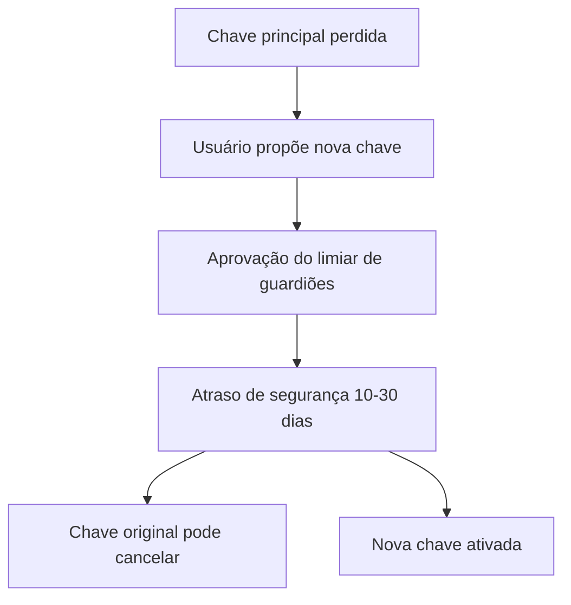

# 📜 Aevum & Bond: White Paper

**Blueprint para um Ecossistema Financeiro de Ledger Duplo e Pós-Quântico**

**Versão:** 2.0  
**Website:** [www.aevum.bond](https://www.aevum.bond)  
**Data:** Agosto de 2025

---

## 🌟 Visão Geral do Ecossistema

**Aevum & Bond** é um ecossistema financeiro de criptomoedas projetado para ser uma **solução completa e à prova de futuro**, corrigindo as principais falhas de sistemas mais antigos como o Bitcoin. Ele é composto por duas blockchains distintas que trabalham em conjunto:

### 🛡️ Bond (BND): A Reserva de Valor
- **"Ouro Digital"** do sistema
- Blockchain **lenta e extremamente segura**
- Consenso **Proof-of-Work** + mais alto nível de criptografia pós-quântica
- Criada para **armazenar valor a longo prazo** de forma imutável

### ⚡ Aevum (AEV): A Moeda Transacional
- **"Dinheiro Digital"** para uso diário
- Blockchain **rápida e de baixo custo**
- Consenso **Delegated Proof-of-Stake**
- Ideal para pagamentos, contratos inteligentes e aplicações

---

## 🚀 Principais Inovações e Diferenciais

### 🔮 Segurança Pós-Quântica
**Ambos os protocolos já nascem protegidos** contra ataques de futuros computadores quânticos, algo que é uma ameaça para criptomoedas atuais.

### 👥 Recuperação Social e Herança
Através de um sistema chamado **"Abstração de Contas Nativa"**, o ecossistema resolve um dos maiores problemas das criptos: a **perda definitiva de fundos**. Você pode designar "guardiões" (pessoas de confiança) para:
- Ajudar a recuperar sua conta caso perca o acesso
- Herdar seus ativos de forma programada e segura

### ⚖️ Arquitetura de Ledger Duplo
Ao separar a **reserva de valor (Bond)** da **moeda transacional (Aevum)**, o ecossistema consegue ser, ao mesmo tempo:
- ✅ **Extremamente seguro** para guardar patrimônio
- ✅ **Eficiente** para uso no dia a dia

---

# 🪙 Parte I: O Protocolo Aevum (AEV)
## A Moeda da Era Pós-Quântica

### 📝 Resumo

Este documento apresenta **Aevum (AEV)**, uma nova criptomoeda projetada para servir como uma **moeda digital universal** segura, escalável e sustentável. Inicia-se com uma análise crítica de protocolos de primeira geração, como o Bitcoin, identificando limitações fundamentais em sua tokenomia, escalabilidade, experiência do usuário e segurança criptográfica.

### 🏗️ Quatro Pilares Fundamentais

1. **🗳️ Consenso DPoS Pós-Quântico**
   - Alto rendimento com **CRYSTALS-Dilithium** (NIST)

2. **📊 Tokenomia de Inflação Reativa**
   - Ajusta emissão baseada na atividade da rede

3. **🧠 Abstração de Conta Nativa**
   - Cada conta = contrato inteligente programável

4. **🛡️ Sistema de Recuperação Social**
   - Elimina perda irreversível de fundos

---

## 🌅 Introdução: Uma Nova Época para a Moeda Digital

A criação do **Bitcoin por Satoshi Nakamoto em 2009** foi um marco, provando que uma moeda digital descentralizada era possível. No entanto, embora pioneiro, seu design contém **falhas inerentes** que o impedem de alcançar o status de uma verdadeira moeda universal:

- 📈 **Volatilidade extrema**
- 🐌 **Limitações de escalabilidade** 
- 😤 **Experiência de usuário implacável**
- 🔓 **Vulnerabilidades criptográficas futuras**

### 💫 Aevum: A Evolução Necessária

**Aevum**, do latim para "tempo" ou "eternidade", é projetado para ser uma **base monetária duradoura**. Sua menor unidade, um **centavo de AEV**, permite divisibilidade adequada para microtransações e um sistema financeiro global.

> **Aevum não é uma melhoria incremental; é uma reimaginação fundamental do que uma moeda digital deve ser.**

---

## 📊 Seção 1: Retrospectiva Crítica dos Protocolos de Primeira Geração

### 1.1 💥 O Paradoxo da Tokenomia

**Oferta fixa de 21 milhões do Bitcoin** → **Duas falhas críticas:**

#### Volatilidade Extrema
- Oferta inelástica + demanda flutuante = meio de troca não confiável

#### Crise do Orçamento de Segurança  
- Subsídios de bloco → zero (por volta de 2140)
- Segurança dependente **exclusivamente** das taxas de transação
- **Paradoxo:** para ser seguro, precisa de taxas altas; para ser útil, precisa de taxas baixas

### 1.2 🚧 A Barreira da Escalabilidade

- **~4.6-7 TPS** não suporta comércio global
- Soluções de camada 2 (Lightning Network):
  - ➕ Reduzem congestionamento
  - ➖ Adicionam complexidade
  - ➖ Podem promover centralização em custódia

### 1.3 💸 O Dilema da Custódia

**Autocustódia no Bitcoin = Fardo imenso**
- Um único erro = perda permanente e irreversível
- Sistema para adoção universal **não pode** ter modo de erro catastrófico
- **Ausência de recuperação nativa = falha crítica de design**

### 1.4 ⚛️ A Ameaça Quântica Iminente

- **Bitcoin (ECDSA)** vulnerável a computadores quânticos
- **25% do fornecimento** em endereços com chave pública exposta
- Ameaça **"colher agora, descriptografar depois"**
- **Construir nova moeda sobre criptografia pré-quântica = obsolescência planejada**

---

## 🏛️ Seção 2: A Arquitetura Aevum

### 2.1 🔒 Consenso e Segurança Pós-Quântica

**Delegated Proof-of-Stake (DPoS) + CRYSTALS-Dilithium (ML-DSA)**

#### Vantagens do DPoS:
- ✅ **Alto rendimento**
- ✅ **Eficiência energética**
- ✅ **Verificação rápida** (essencial para alto TPS)

#### Segurança Pós-Quântica:
```
Algoritmo: CRYSTALS-Dilithium (ML-DSA)
Padrão: NIST
Resistência: Computação quântica
Aplicação: Transações + Blocos + Governança
```

### 2.2 📈 Tokenomia de Inflação Reativa

**Ciclo Virtuoso Sustentável:**

#### Emissão Perpétua
- Novos AEV criados a cada bloco
- **Divisão:** Recompensas de Staking + Tesouro do Ecossistema

#### Taxa Adaptativa
- **Meta:** taxa de staking ideal (60-75%)
- **Resultado:** segurança economicamente eficiente

#### Redução por Atividade
```
↗️ Volume de transações 
    ↓
💡 Contrato inteligente ativado
    ↓
📉 Redução da taxa de emissão futura
    ↓
🎯 Escassez suave e previsível
```

**Parâmetros da Política Monetária:**
- **Piso inflação diária:** 0.005%
- **Teto inflação diária:** 0.025%
- **Faixa anual composta:** ~1.84% a ~9.55%

### 2.3 🧠 Abstração de Conta Nativa

**Apenas um tipo de conta: Conta Inteligente**

#### Funcionalidades Native AA:
- 🔑 **Assinaturas Flexíveis:** multi-sig, recuperação social, futuros algoritmos PQC
- 💳 **Abstração de Gás:** pague taxas em outros tokens ou taxas patrocinadas por DApps  
- 📦 **Agrupamento de Transações:** múltiplas operações em transação atômica

### 2.4 👥 Recuperação Social: Eliminando a Perda Irreversível

#### Processo de Configuração:
1. **Designar Guardiões:** pessoas/contas de confiança
2. **Definir Limiar:** ex: 3 de 5 guardiões
3. **Configurar Períodos:** inatividade + atraso de segurança

#### Fluxo de Recuperação:


#### Recuperação Acelerada:
- **Mais guardiões solicitando** = **tempo reduzido**
- **Exemplo:** 10 dias ÷ 3 guardiões = ~4 dias

---

## 🎯 Cenários de Uso Avançados

### 🔄 Recuperação Pessoal
- Configurar guardiões para recuperar acesso próprio
- **Regras distintas:** Aevum (rápida) vs Bond (lenta + mais guardiões)

### 👨‍👩‍👧‍👦 Herança Digital
- **Pré-configurar percentuais** para cada guardião/herdeiro
- **Inatividade prolongada** → acesso direto à parte dos ativos
- **Elimina procedimentos legais** complexos

### 📜 Testamentos Digitais
- **Regras complexas:** Aevum → família, Bond → caridade
- **Não apenas criptoativos:** e-mail, redes sociais, jogos
- **Sistema abrangente** de herança digital

---

## ⚙️ Mecanismos de Controle e Segurança

### 🔢 Limite de Tentativas
- Titular define limite de tentativas falhadas
- **Limite atingido:** bloqueio recuperação pessoal → apenas herança

### ⏱️ Período de Carência  
- **Espera configurável** (ex: 15 dias) após acionamento
- Tentativa de contato antes de notificar guardiões

### 💓 Prova de Vida
- **Ação periódica obrigatória** (ex: assinar mensagem a cada 365 dias)
- **Falha → recuperação iniciada automaticamente**

---

## 🏛️ Seção 3: Governança e Ecossistema Aevum

### 3.1 🗳️ Governança Descentralizada
- **Detentores de tokens** votam em:
  - Atualizações do protocolo  
  - Uso do tesouro do ecossistema

### 3.2 💰 Tesouro do Ecossistema

**Motor Econômico financiado pela inflação adaptativa:**

#### Alocação de Fundos:
- 🔧 **Desenvolvimento** do protocolo principal
- 🔬 **Pesquisa criptográfica** contínua  
- 💻 **Subsídios** para desenvolvedores de DApps e infraestrutura
- 📢 **Iniciativas** de adoção e marketing

**Resultado:** Sistema financeiro **autossustentável e soberano**

---

# ⛓️ Parte II: O Protocolo Bond (BND)
## A Reserva de Valor Universal Pós-Quântica

### 1.1 💎 Filosofia: Forjando Escassez Digital com PoW

**Fundação para reserva de valor universal:**
- ✅ **Segurança intransigente**
- ✅ **Imutabilidade demonstrável**

#### Por que Proof-of-Work?
- **Segurança baseada** em princípios físicos e matemáticos
- **Dispêndio real** de energia e poder computacional
- **Barreira formidável** contra manipulação

#### Estrutura Competitiva:
```
Mineradores competem por quebra-cabeças criptográficos
    ↓
Primeiro com solução válida = direito de adicionar bloco
    ↓  
Alterar histórico = refazer TODOS os blocos subsequentes
    ↓
Ataque 51% = controle de +50% do poder computacional
    ↓
Proibitivamente caro em rede madura
```

#### Vantagem Filosófica:
- **Base de confiança "trustless"** ancorada no mundo físico
- **Validação por prova de trabalho** publicamente auditável
- **Sem dependência** de reputação ou capital de validadores
- **Custo energético ≠ desperdício = preço da soberania monetária digital**

---

### 1.2 🔧 Arquitetura de Consenso: PoW Pós-Quântico

#### Algoritmo de Hashing: Keccak-256 (SHA-3)

**Por que não SHA-256 (Bitcoin)?**
- ✅ **Design interno diferente:** construção "esponja"
- ✅ **Imune a ataques** de extensão de comprimento
- ✅ **Diversificação criptográfica** (não dependente de SHA-2)
- ✅ **Resistência inicial a ASICs** → maior descentralização

#### Parâmetros de Bloco (Conservadores):

| Parâmetro | Valor | Justificativa |
|-----------|-------|---------------|
| **Tempo de Bloco** | 10 minutos | Propagação global segura, minimiza forks órfãos |
| **Tamanho de Bloco** | 4 MB | Equilibra capacidade PQC vs requisitos de nó |
| **Ajuste de Dificuldade** | A cada 2016 blocos (~2 semanas) | Estabilidade e previsibilidade |

---

### 1.3 🔐 Segurança Criptográfica: Padrão FIPS 204

#### A Ameaça Existencial Quântica
**Computador quântico + Algoritmo de Shor** = capacidade de quebrar:
- ECDSA (Bitcoin)
- RSA (infraestrutura atual)
- **Todos os esquemas** de chave pública clássica

> **Para um ativo projetado para durar décadas ou séculos, a resistência quântica não é uma opção, é um requisito absoluto desde o primeiro dia.**

#### ML-DSA: Nossa Escolha

**Module-Lattice-Based Digital Signature Algorithm (CRYSTALS-Dilithium)**
- 🏛️ **Padronizado:** NIST FIPS 204
- 🧮 **Baseado em:** problemas matemáticos em reticulados (lattices)
- 🔒 **Resistente:** ataques clássicos E quânticos

#### Bond: ML-DSA-65 (Dilithium 3)
- **Nível de Segurança:** 3 (equivalente a AES-192)
- **Escolha conservadora:** margem ampla de segurança
- **Trade-off aceito:** tamanho maior por robustez máxima

---

### 📊 Comparação de Esquemas de Assinatura

| Esquema | Nível NIST | Chave Pública | Assinatura | Aumento vs ECDSA |
|---------|------------|---------------|------------|------------------|
| **ECDSA (secp256k1)** | Clássico | 64 bytes | ~70 bytes | **1x** |
| **ML-DSA-44 (Dilithium 2)** | Nível 1 | 1.312 bytes | 2.420 bytes | **~28x** |
| **ML-DSA-65 (Dilithium 3)** | Nível 3 | 1.952 bytes | 3.293 bytes | **~40x** |

#### Impacto na Arquitetura:
- **Transação simples Bond:** ~3.500 bytes
- **Capacidade máxima:** ~1.100 transações/bloco (4MB)
- **Trade-off explícito:** capacidade transacional sacrificada por segurança quântica robusta

**Este é perfeitamente alinhado com a função primária do Bond: reserva de valor onde certeza supera velocidade.**

---

### 1.4 🧩 Inovação de Ledger: UTXO + Abstração de Contas

#### O Dilema do UTXO Tradicional:
- ✅ **Vantagens:** escalabilidade, privacidade, paralelismo
- ❌ **Desvantagem crítica:** gestão de chaves rígida e implacável

#### Solução: UTXOs Programáveis (pUTXOs)

**Cada UTXO → Mini-contrato inteligente**

```rust
// Em vez de controle por chave única:
UTXO → SingleKey

// pUTXO com script de autorização:
pUTXO → ProgrammableScript {
    primary_key: Option<Key>,
    guardians: Vec<Key>,
    threshold: u32,
    recovery_rules: RecoveryLogic,
    // ... outras regras
}
```

#### Funcionalidades Nativas:

##### 👥 Recuperação Social e Herança
```
Script: "Este UTXO pode ser gasto com:
- Assinatura da chave A (principal) OU  
- Combinação de 3 de 5 assinaturas das chaves G1-G5 (guardiões)"
```

**Automação baseada em inatividade:**
- Titular define período (ex: 365 dias)
- Guardiões/herdeiros iniciam recuperação
- Acesso à percentual pré-definida dos ativos
- **Testamentos digitais personalizáveis**

##### 🔐 Autenticação Multifator (MFA)
- Script exige múltiplas chaves para valores altos
- Ex: smartphone + hardware wallet

##### 🔄 Resistência Quântica Evolutiva  
- Atualizar script de autorização sem mover fundos
- Identidade da conta permanece, segurança evolui

#### Resultado Final:
**Benefícios do UTXO** (segurança, paralelismo) + **UX da Abstração de Contas** (recuperação, flexibilidade) = **Reserva de valor utilizável e perdoável para humanos**

---

### 1.5 💰 Modelo Econômico, Tokenomia e Governança

#### Tokenomia de Inflação Adaptativa

**Bond rejeita oferta fixa** → **Ciclo virtuoso adaptativo:**

##### Emissão Perpétua e Orçamento de Segurança
- Novos BND criados a cada bloco
- **Orçamento perpétuo** não dependente exclusivamente de taxas

##### Taxa Adaptativa Inversa ao Hashrate
```
Hashrate baixo → Inflação aumenta → Atrai mineradores
Hashrate alto → Inflação diminui → Promove escassez
```

##### Mecanismo de Maturação
- **Longo prazo:** inflação base diminui lentamente
- **Resultado:** escassez crescente conforme rede amadurece

#### Parâmetros de Inflação:
- **Piso diário:** 0.005%
- **Teto diário:** 0.01%  
- **Faixa anual composta:** ~1.84% a ~3.72%

#### Denominações e Divisibilidade:
```
1 Bond (BND) = 1.000 Elos
Elo = menor unidade de conta
```

#### Modelo de Taxas:
- **Taxa fixa:** 1 Elo por bloco de 250 bytes
- **Gorjeta:** opcional para prioridade

#### Governança e Tesouro:
- **Divisão da recompensa:** 80% mineradores + 20% Tesouro
- **Governança on-chain:** detentores BND deliberam sobre atualizações e uso do tesouro

---

## 🚀 Parte III: Estratégia de Mercado e Adoção

### 📅 Seção 4: Lançamento em Fases

#### Fase 1 (Anos 0-2): Fundação e Credibilidade
- **Público-alvo:** criptógrafos, desenvolvedores, pesquisadores
- **Foco:** testnets, especificações, auditorias de segurança

#### Fase 2 (Anos 2-4): Adotantes Iniciais  
- **Público-alvo:** fintechs, empresas de remessas, jogos Web3
- **Mercados:** especialmente emergentes

#### Fase 3 (Anos 4+): Adoção em Massa
- **Público-alvo:** consumidores, comerciantes, empresas
- **Estratégia:** campanhas amplas + carteiras fáceis

---

### 📱 Seção 5: Iniciativa de Código QR

**Estratégia:** Integração aos comportamentos de pagamento existentes

#### Visão: "Pix Global"
- **Não substituir** sistemas domésticos (como Pix)
- **Complementar** com funcionalidades globais:
  - ✅ Pagamentos transfronteiriços
  - ✅ Programabilidade  
  - ✅ Descentralização

#### Implementação:
- **Protocolo QR** padronizado e código aberto
- **Financiado** pelo ecossistema Aevum & Bond
- **Dominante** em mercados de alto crescimento (América Latina + Ásia)

---

### 💡 Seção 6: Crescimento do Ecossistema

**Ciclo auto-reforçado com três pilares estratégicos:**

#### 🏪 Subsídios de Integração (Lado da Oferta)
- **Reduzir fricção** para comerciantes e processadores
- **Exemplos:**
  - Cobrir custos de engenharia para e-commerce integrar Aevum
  - Incluir em software POS sem taxas
- **Objetivo:** "Pagar com Aevum" = opção ubíqua e fácil

#### 💳 Programa de Reembolso (Lado da Demanda)  
- **Incentivar mudança** de comportamento do consumidor
- **Exemplo:** 1-2% de reembolso instantâneo em AEV
- **Resposta à pergunta:** "Por que usar isto em vez do meu método habitual?"

#### 💻 Financiamento para Desenvolvedores
- **Carteiras de nicho** (ex: multi-sig familiar)
- **DApps inovadores** (DeFi, jogos, redes sociais)  
- **Infraestrutura crítica** (exploradores, análises)
- **Resultado:** ecossistema rico, vibrante e fácil de construir

---

## 🛠️ Parte IV: Iniciativas Complementares

### 🔒 Hardware Wallet "Arca"

#### Visão:
**Dispositivo de referência, código aberto, para cold storage Bond**

#### Especificações:
- **MCU seguro** com Secure Element
- **Tela baixo consumo** (E-Ink/Memory-in-Pixel)
- **Botões físicos** para confirmação explícita
- **Comunicação primária:** códigos QR animados (air-gapped)
- **Firmware:** 100% Rust (Embedded)

#### Ferramentas de Desenvolvimento:
- **Eletrônica:** KiCad + Celus
- **Mecânica:** FreeCAD/Fusion 360  
- **Firmware:** Rust + Embassy framework

---

### 💰 Proposta de Financiamento Inicial

#### Objetivo: $50.000 USD

##### Mecanismo: Venda de Gênese Comunitária
- **Ativo oferecido:** AEV
- **Taxa:** $1.00 USD = 5.000 AEV
- **Rede:** Arbitrum (baixas taxas)
- **Duração:** 30 dias OU até limite atingido

##### Tecnologia:
- **Smart contract** auditável
- **Funcionalidades:**
  - Aceitar USDC/USDT
  - Registrar contribuintes
  - Parada automática em $50k
  - Transferência para multi-sig do tesouro

---

## 📅 Parte V: Roadmap de Desenvolvimento

**Data de Início:** 1 de outubro de 2025

### 🏗️ Sprint 1-4: Fundação (Mai-Jun 2025)
- **Sprint 1:** Blockchain local funcional
- **Sprint 2:** Segurança pós-quântica
- **Sprint 3:** Rede P2P  
- **Sprint 4:** Consenso descentralizado → **Testnet 1**

### ⚡ Sprint 5-8: Protocolos Avançados (Jun-Ago 2025)
- **Sprint 5:** Transações programáveis (pUTXOs)
- **Sprint 6:** Fundação Aevum (DPoS)
- **Sprint 7:** Staking e governança → **Testnet 2**  
- **Sprint 8:** Ponte inter-ledger → **Testnet 3**

### 🔧 Sprint 9-12: Produção (Ago-Out 2025)
- **Sprint 9:** Ferramentas do usuário (carteira Tauri)
- **Sprint 10:** Endurecimento e auditoria
- **Sprint 11:** Empacotamento e documentação
- **Sprint 12:** **🚀 Lançamento da Mainnet v1.0**

### 🌐 Sprint 13-14: Mercado (Out-Nov 2025)
- **Sprint 13:** Website e presença online
- **Sprint 14:** Marketing e financiamento → **$50k assegurados**

---

## 🔒 Parte VI: Análise de Segurança

### 🎯 Avaliação Geral: **B+** 
*(Bom, com questões críticas a endereçar)*

#### ✅ Pontos Fortes:
- **Criptografia:** ML-DSA pronto, verificação abrangente
- **Transações:** prevenção gastos duplos, validação de scripts  
- **Consenso:** ajuste dificuldade (PoW) + seleção por stake (DPoS)
- **Memória:** segurança garantida pelo Rust

#### ⚠️ Áreas que Requerem Atenção:
- **Implementação Ed25519 temporária** NÃO é resistente quântica
- **Validação:** falta limites explícitos para tamanhos  
- **Scripts:** ausência de limites de computação (gás)

#### 📋 Recomendações:

##### Imediatas (Críticas):
- ✅ Concluir implementação ML-DSA  
- ✅ Adicionar limites de recursos
- ✅ Aritmética segura (evitar overflow)

##### Curto Prazo:
- Sistema de gás para scripts
- Rate limiting por endereço
- Segurança de rede P2P

##### Longo Prazo:
- Verificação formal da lógica de consenso
- Auditoria de segurança por terceiros  
- Fuzzing abrangente

---

## 🏁 Conclusão

> **O Bitcoin provou que a moeda digital é viável, mas sua arquitetura de primeira geração a impede de servir como uma base monetária global.**

### **Aevum & Bond é a resposta.**

#### Ao integrar:
- 🔮 **Criptografia pós-quântica**
- 📈 **Tokenomia sustentável**  
- 🧠 **Abstração de conta nativa** com recuperação social

#### O resultado:
**Ecossistema que estabelece novo padrão** onde a reserva de valor é **desacoplada** da volatilidade da camada de aplicação.

#### Governado por sua comunidade:
Sistema **autossustentável** posicionado para ser a **base de um sistema financeiro global, seguro e à prova de futuro**.

---

### 🌟 **A Era da Moeda Digital Verdadeiramente Universal Começa Agora**

**Junte-se à revolução financeira pós-quântica.**

---

*Este documento representa um plano abrangente para construir a espinha dorsal de um sistema financeiro global mais seguro, acessível e resiliente para a era pós-quântica e além.*
